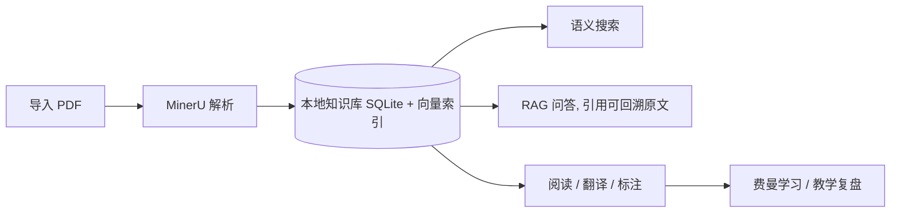

<p align="center">
  
</p>

<h1 align="center">ZoomPaper</h1>

<p align="center"><strong>本地优先的论文阅读与知识管理平台 —— 把论文读成自己的知识</strong></p>

<p align="center">
  <a href="https://github.com/Flutter-Misdreavus/ZoomPaper/releases">
    
  </a>
  
  
  
  
  
</p>

<p align="center">
  <a href="#一键下载">一键下载</a> ·
  <a href="https://github.com/Flutter-Misdreavus/ZoomPaper/releases/latest">GitHub Releases</a> ·
  <a href="#从源码构建">从源码构建</a> ·
  <a href="#使用指南">使用指南</a> ·
  <a href="#数据与存储">数据与存储</a>
</p>

> **说明** —— 本仓库既是源码仓库，也是官方下载渠道。最新安装包发布在
> [GitHub Releases](https://github.com/Flutter-Misdreavus/ZoomPaper/releases/latest)。

---

## 这是什么

读论文是一趟**从文献到知识**的旅程：先读原文，再理解脉络，最后能用自己的话讲出来。
ZoomPaper 把这条链路做成了一个 macOS 桌面应用 —— 所有数据留在你自己的电脑上，云只负责算力。

像 Zotero 一样管文献，像 Obsidian 一样沉淀笔记，像费曼一样学进去。



## 核心功能

### 导入与解析

一键导入 PDF，调用 **MinerU** 云解析为结构化 Markdown（含图片与章节分块），
自动提取标题与摘要，并建立本地向量索引。
Chrome / Edge 可通过[浏览器扩展](browser-extension/README.md)从论文网页或 PDF 链接导入。

### 沉浸式阅读

原文 PDF / 中文译文 / AI 博客三种视图自由切换；大纲导航、双指捏合缩放、文内链接跳转；
划选文字即可速译、高亮、写笔记，标注随文档缩放自适应。

### AI 翻译

分块中译全文，参考文献自动跳过、不浪费 token；译文缓存复用，一键重新翻译。

### 语义搜索

本地 embedding（`bge-small-en-v1.5`）+ `sqlite-vec`，无需云端即可跨论文检索段落。

### 知识库问答（RAG）

跨论文提问，回答带 `[n]` 引用标记，点击直达原文位置；阅读时选中段落可**就地提问**。
**快速 / 深度双模式**：快速 = 单轮检索回答；深度 = AI 自主调用工具多角度研读论文
（语义检索、章节精读、目录、元数据、你的标注与译文），并可**联网搜索**（复用
DeepSeek / Anthropic Key 的原生搜索，无需额外密钥）补齐背景与最新进展，回答更深入，
工具调用轨迹可折叠查看。深度模式下 AI 信息不足时会**向你澄清**（选项或自由作答后
从断点继续），同会话还会**记忆已查证来源**，后续提问直接复用、不重复检索。
AI 工作全程**实时可见**：思考内容逐字流出、每个工具「调用中 → 完成（耗时）」实时
更新、最终回答流式呈现，并记录「AI 思考 Xs · 工具调用 Ys」随消息持久化。

### 费曼学习法

把论文讲成自己的知识：AI 先为论文生成**概念教学计划**（可增删调序），你作为老师
逐个概念讲解，学生追问、出测验题检验你讲得是否透彻（不过关会标注缺口让你补讲）；
长对话自动滚动摘要，全部讲完后一键生成教学复盘。

### 访达式论文库

虚拟文件夹（嵌套 / 多归属 / 颜色 / 标签）、拖拽归类、内联重命名、列表/网格双视图 ——
像 macOS 访达一样整理论文，删除文件夹不会丢失任何论文。

### 本地优先

论文、索引、标注、对话全部保存在本机 SQLite 与文件目录，无账号、无云同步依赖，
备份即拷贝。

## 一键下载

### 方式一：下载安装包（推荐）

<p align="center">
  <a href="https://github.com/Flutter-Misdreavus/ZoomPaper/releases/latest">
    
  </a>
</p>

最新版本 → <https://github.com/Flutter-Misdreavus/ZoomPaper/releases/latest>

| 平台                    | 安装包                                   |
| ----------------------- | ---------------------------------------- |
| macOS（Apple Silicon 与 Intel 通用） | `ZoomPaper_<ver>_universal.dmg` |

**安装步骤**：

1. 打开下载的 `.dmg` 文件；
2. 把 **ZoomPaper** 拖入 **Applications** 文件夹；
3. 首次打开：因应用未经过 Apple 签名公证，请在访达中**右键点击应用图标 →「打开」**，
   如提示「无法验证开发者」，点击「仍要打开」；或执行：

   ```sh
   xattr -dr com.apple.quarantine /Applications/ZoomPaper.app
   ```

### 方式二：一行命令安装

macOS（Apple Silicon / Intel）

```sh
curl -fsSL https://raw.githubusercontent.com/Flutter-Misdreavus/ZoomPaper/main/install.sh | sh
```

脚本会自动识别机器架构，从 GitHub Releases 下载对应的 `.dmg` 并安装到
`/Applications`；已是最新版本时会自动跳过。

### 方式三：从源码构建（开发者）

见下方 [从源码构建](#从源码构建) 一节。

## 从源码构建

### 环境要求

- **macOS 13+**（应用基于 Tauri v2 + WKWebView）
- **Node.js ≥ 20**（Vite 7 要求）
- **Rust stable ≥ 1.77**（Tauri 2 要求）
- Xcode Command Line Tools（`xcode-select --install`）

### 安装与构建

```bash
# 1. 安装依赖
npm install

# 2. 开发模式（启动桌面应用，改动热更新）
npm run tauri dev

# 3. 打包为 .app / .dmg
npm run tauri build
```

构建产物位于 `src-tauri/target/release/bundle/`，可直接分发或上传至 GitHub Releases。

## 使用指南

### 第一步：配置 API Key

打开 **设置** 页：

| 服务                          | 用途                           | 是否必需 |
| ----------------------------- | ------------------------------ | -------- |
| **MinerU**                    | PDF → Markdown 高精度解析       | 必需     |
| **OpenAI / Anthropic / Gemini / DeepSeek** | 翻译、博客、问答、费曼 | 任选其一 |

可在设置中自定义论文库目录（默认存放在应用数据目录）；向量检索使用本地
embedding 模型，首次使用自动下载。

### 第二步：导入与解析

论文库页点击 **「导入论文」** 选择 PDF，应用会自动复制进本地库并触发 MinerU 解析。
解析完成后即可阅读、搜索、问答。

### 第三步：阅读与学习

- **阅读**：左栏切换原文 / 中文译文 / AI 博客；划选文字即可高亮、写笔记
- **问答**：阅读页右侧问答面板随时提问（单篇），或到问答页进行跨论文检索
- **费曼**：阅读页打开费曼面板，AI 生成概念教学计划后逐个概念闯关讲解，
  用测验逼出你的盲区，最后生成复盘

### 整理论文库

- 左侧侧栏 **「新建文件夹」**，右键文件夹可改颜色、加标签、建子文件夹
- 直接**拖拽**论文（支持多选批量拖）到文件夹完成归类；一篇论文可同时属于多个文件夹
- 双击标题**内联重命名**；删除文件夹不会删除论文（自动回到「未分类」）

## 数据与存储

一切数据都属于你，备份即拷贝：

```
~/Library/Application Support/com.paper-reader/
├── database.sqlite          # 结构化数据 + 向量索引（SQLite / sqlite-vec）
├── settings.json            # API Key 与偏好设置
└── papers/                  # 论文库（可在设置中改路径）
    └── {uuid}/
        ├── paper.pdf        # 原始 PDF
        ├── paper.md         # MinerU 解析结果
        ├── blog.md          # AI 博客
        ├── images/          # 解析出的图片资源
        ├── annotations.json # 高亮与笔记
        └── translation.json # 中文译文缓存
```

## 技术架构

| 层级         | 选型                                   | 说明                             |
| ------------ | -------------------------------------- | -------------------------------- |
| 桌面框架     | **Tauri v2**                           | Rust 后端 + 系统 WebView，原生 `.app` |
| 前端         | **React 19 + TypeScript + Vite**       | Tailwind CSS v4 + shadcn/ui（Base UI）+ Motion |
| 本地数据库   | **SQLite（rusqlite）**                 | 单文件，备份即拷贝               |
| 向量检索     | **sqlite-vec**                         | SQLite 扩展，零外部依赖          |
| 本地 Embedding | **fastembed（bge-small-en-v1.5）**   | 384 维，纯本地推理               |
| PDF 解析     | **MinerU API**                         | 云端转换，结果落本地             |
| PDF 渲染     | **pdfjs-dist + KaTeX**                 | 阅读器与公式渲染                 |

```
├── src/                    # 前端（React）
│   ├── pages/              # 论文库 / 阅读器 / 搜索 / 问答 / 设置
│   ├── components/         # PDF 阅读、问答、费曼、翻译、标注等面板
│   └── lib/                # API 封装、文件夹树、Markdown 工具
└── src-tauri/              # 后端（Rust）
    ├── src/
    │   ├── commands.rs     # Tauri 命令层（论文 / 检索 / 问答 / 费曼 / 整理）
    │   ├── agent/          # 深度研究 agent：工具注册表 + 循环驱动 + 联网搜索
    │   ├── db/             # SQLite 迁移与数据模型
    │   ├── rag/            # 分块、向量索引、检索
    │   ├── ai/             # LLM 多 Provider（含工具调用）、Embedding、MinerU
    │   └── fs/             # 论文目录与文件管理
    └── capabilities/       # 权限声明
```

## Roadmap

- [ ] 元数据增强：作者、年份、期刊自动提取与展示
- [ ] PDF 首页缩略图网格视图
- [ ] 文件夹拖拽重组与自定义排序
- [ ] 标签全局筛选与文件夹维度搜索
- [ ] 阅读进度 / 统计仪表盘
- [ ] Windows / Linux 支持

## 协议

本项目基于 [MIT License](LICENSE) 开源。

Copyright © 2025 Flutter-Misdreavus

你可以自由地**使用、修改、分发**（含商业用途），只需在副本中保留上述版权声明与许可声明。
本项目按「现状」提供，不附带任何明示或默示的担保。

---

<p align="center">
  <sub>
    <a href="https://github.com/Flutter-Misdreavus/ZoomPaper">在 GitHub 上查看</a> ·
    <a href="https://github.com/Flutter-Misdreavus/ZoomPaper/releases/latest">下载最新版本</a> ·
    <a href="#一键下载">一键安装</a>
  </sub>
</p>
