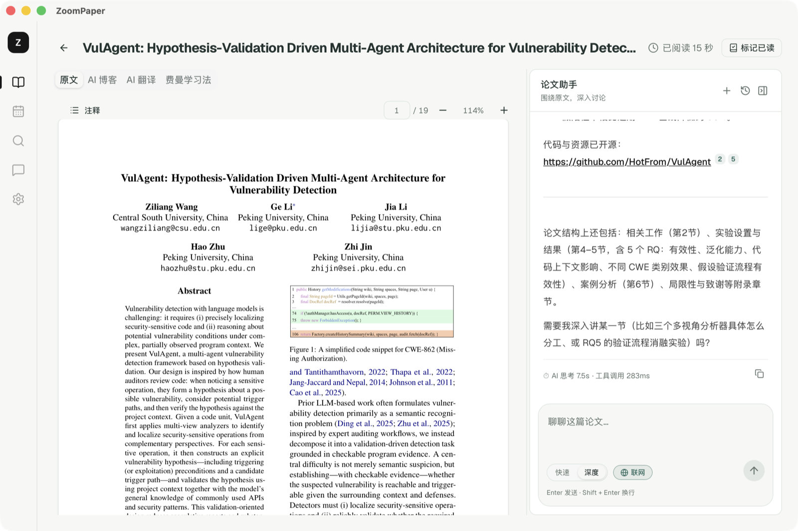
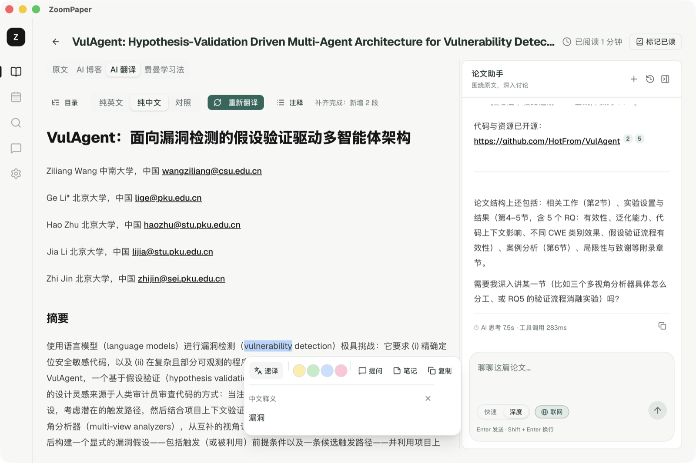
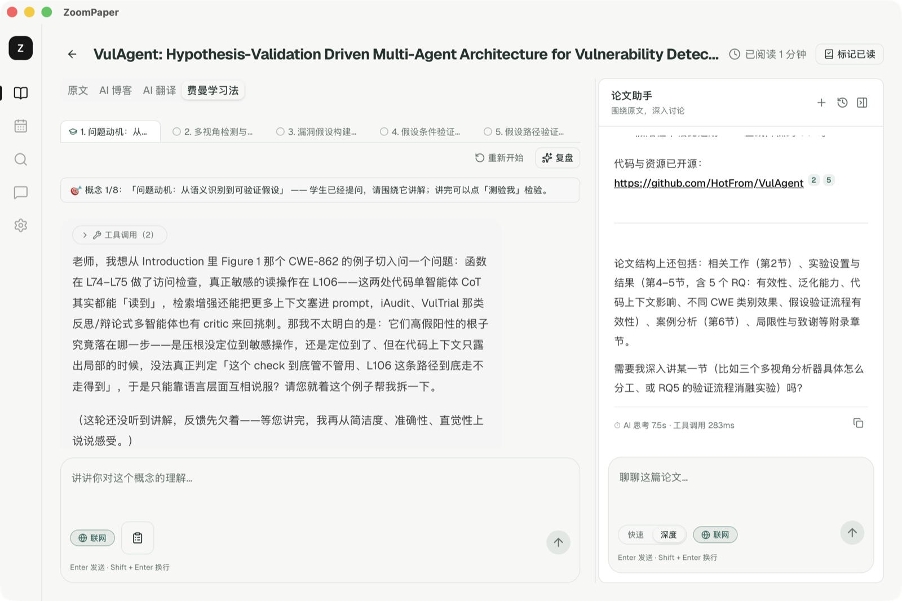

<p align="center">
  
</p>

<h1 align="center">ZoomPaper Plus</h1>

<p align="center"><strong>AI 英文论文阅读助手</strong></p>

<p align="center">
  ZoomPaper Plus 面向需要阅读英文论文的中文用户，把 PDF 阅读、划词翻译、全文翻译、带引用的 AI 问答和论文整理放在一个桌面应用里，减少在翻译工具、浏览器和笔记软件之间来回切换。
</p>

<p align="center">
  <a href="https://github.com/bingxunqing/ZoomPaper-plus/releases/latest">下载最新版本</a> ·
  <a href="https://github.com/Flutter-Misdreavus/ZoomPaper#readme">上游项目说明</a>
</p>

## 界面预览

<p align="center">
  
  <br />
  <sub>边读英文论文，边翻译、提问和核对原文引用。</sub>
</p>

<table>
  <tr>
    <td width="50%">
      
      <br />
      <sub><strong>划词速译：</strong>选中术语，直接查看简洁中文释义。</sub>
    </td>
    <td width="50%">
      
      <br />
      <sub><strong>费曼学习：</strong>按概念学习，用追问和测验检查理解。</sub>
    </td>
  </tr>
</table>

## 相比上游多了什么

- **划词速译**：在 PDF、AI 博客和中文译文中选中文字，立即获得结合上下文的中文释义。
- **更好用的 AI 对话**：重新设计消息、引用和输入区，支持停止生成、复制回答、历史会话以及快速/深度模式。
- **浏览器一键收藏**：从 Chrome / Edge 论文页面右键加入 ZoomPaper Plus，自动下载并解析 PDF；覆盖常见计算机论文网站。
- **更完整的论文库**：支持文件夹、筛选、排序、继续阅读、阅读计划和笔记导出。
- **可靠性修复**：修复中文输入、DeepSeek 工具调用、标注覆盖、数据库阻塞和本地密钥权限问题。

原项目的完整功能和配置方式请查看[上游 README](https://github.com/Flutter-Misdreavus/ZoomPaper#readme)。

软件内的“帮助”页面提供操作说明和功能问答；完整功能索引见[使用指南](docs/USER_GUIDE.md)。

## 下载

支持 macOS、Windows 和 Linux 桌面系统。

| 发布附件 | 用途 |
| --- | --- |
| `ZoomPaper.Plus_<版本>_aarch64.dmg` | macOS 13+，Apple Silicon |
| `ZoomPaper.Plus_<版本>_x64-setup.exe` | Windows 10/11，x64 |
| `ZoomPaper.Plus_<版本>_amd64.deb` | Debian / Ubuntu，x64 |
| `ZoomPaper.Plus_<版本>_amd64.AppImage` | 其他常见 x64 Linux 发行版 |
| `ZoomPaper-Plus-Connector_<版本>.zip` | Chrome / Edge 浏览器扩展 |

[前往 Releases 下载](https://github.com/bingxunqing/ZoomPaper-plus/releases/latest)

安装包暂未进行代码签名。macOS 首次启动时，请在访达中右键点击 ZoomPaper Plus 并选择“打开”；若仍被拦截，可执行：

```sh
xattr -dr com.apple.quarantine "/Applications/ZoomPaper Plus.app"
```

Windows 如显示 SmartScreen 提示，请确认下载来源为本仓库后选择“更多信息 → 仍要运行”。Linux 使用 AppImage 时，可能需要先执行 `chmod +x ZoomPaper.Plus_*.AppImage`。

PDF 解析需要配置 MinerU；翻译和 AI 功能需要配置 OpenAI、Anthropic、Gemini 或 DeepSeek 中至少一个服务。

## 浏览器扩展

1. 安装并启动一次 ZoomPaper Plus。在 [Releases](https://github.com/bingxunqing/ZoomPaper-plus/releases/latest) 下载 `ZoomPaper-Plus-Connector_<版本>.zip` 并解压。
2. 打开 Chrome 的 `chrome://extensions` 或 Edge 的 `edge://extensions`，开启**开发者模式**，点击**加载已解压的扩展程序**，选择解压后包含 `manifest.json` 的文件夹。
3. 在论文页面右键选择**加入 ZoomPaper Plus**，或点击扩展图标；首次使用时允许浏览器打开桌面应用。

更新扩展时，替换解压文件后到扩展管理页点击**重新加载**。也可以直接安装仓库中的 [`browser-extension`](browser-extension/README.md) 文件夹；支持的网站见[兼容性说明](docs/BROWSER-SUPPORT.md)。

<details>
  <summary>开发与构建</summary>

  ```sh
  npm install
  npm run tauri dev
  npm run tauri build
  ```

  发布流程见 [docs/RELEASING.md](docs/RELEASING.md)，人工验收见 [docs/WORKFLOW-ACCEPTANCE.md](docs/WORKFLOW-ACCEPTANCE.md)。
</details>

## 协议与致谢

本项目遵循 [MIT License](LICENSE)。感谢 [ZoomPaper 原作者及贡献者](https://github.com/Flutter-Misdreavus/ZoomPaper/graphs/contributors)。本 fork 当前同步至上游 `v0.3.0`。
